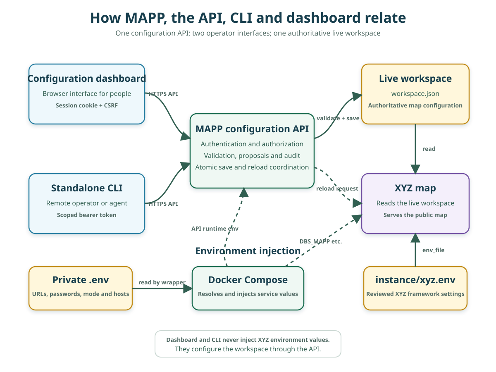

# Architecture



The environment section distinguishes the private deployment `.env`, which
the `mapp` wrapper passes to Docker Compose for runtime substitution, from
`instance/xyz.env`, which Compose supplies to XYZ as its reviewed framework
settings. Values such as `DBS_MAPP` are resolved from the private `.env` and
injected explicitly into XYZ and the configuration service. The dashboard and
CLI do not inject environment variables; they change the workspace through the
configuration API.

## Scope

MAPP Platform owns the live server and its configuration API. The standalone
`config-cli` is an external client and should be released, installed, and
secured independently.

The proposed multi-source execution model is recorded separately as the
[federation architecture waypoint](federation-architecture-waypoint.md). It is
a north-star development handoff, not part of the currently implemented
deployment contract described on this page.

```text
                         public network
                              │
                              ▼
                       Caddy 80 / 443
                         │          │
                  map hostname   config hostname
                         │          │
                         ▼          ▼
                        XYZ     config dashboard/API
                         │       │       ├── browser runner
                         └──┬────┘       └── semantic service ──> SQLite
                            ▼
              bundled or external PostgreSQL/PostGIS
                            ▲
                            │ bundled sample mode only
                    optional one-shot ETL
                         ▲        ▲
              Leeds ArcGIS   ONS/Nomis Census

external config-cli ── HTTPS/bearer token ──> config API
```

Caddy is the only platform service intended to publish host ports. Bundled
PostgreSQL, XYZ, the configuration service, and the browser runner communicate
over private Compose networks; external PostGIS traffic leaves the backend
network for the operator-managed endpoint. The browser runner shares only the
internal automation network with the configuration service, Caddy, and an
allowlisting Squid proxy. Only that unprivileged proxy joins the dedicated
external network, so Chromium can fetch reviewed basemap assets without a
direct route to arbitrary destinations. The runner does not join the
database/backend or public edge networks and holds no platform credential.
Browser navigation uses a guarded,
un-published Caddy listener on port 8081; the `caddy` hostname is denied on the
published HTTP listener. The semantic service is on a separate internal
network shared only with the configuration service. It has neither a public
route nor a database credential.

## Components

| Component | Responsibility | Persistent inputs/state |
| --- | --- | --- |
| PostgreSQL/PostGIS | Application data and spatial indexes; either bundled sample data or an externally managed server | Named PostgreSQL volume in the local-database modes; external operator in external mode |
| ETL | Optional Leeds sample and reviewed England Census 2021 provisioning through bounded, validated source reads | `instance/etl/layers.json`, `instance/etl/census.json`; local-database modes through the wrapper |
| XYZ | Map UI, MVT and feature queries | `var/workspace/workspace.json`, `instance/xyz.env`, public assets |
| XYZ preview | Isolated rendering of a pending proposal candidate without changing the public map | `var/preview/workspace.json`, `var/preview-reload`, public assets |
| Configuration service | Dashboard, catalog discovery, validation, proposals, audit, preview publication, reload requests, and optional review-only Gemini drafts with separately authorized bounded data context | `var/workspace`, `var/control`, `var/reload`, `var/preview`, `var/preview-reload` |
| Semantic service | Durable generated facts, curated annotations, per-asset proposals, history, and archive tombstones | `var/semantic/semantic.sqlite3` |
| Browser runner | Authenticated visual validation with bounded map origin and isolated outbound asset access | `var/control/artifacts` |
| Caddy | TLS, host routing, response headers, upstream file-provider guard | Caddy named volumes |
| Standalone CLI | Remote inspection, proposals, application and verification | State on the separate client computer |

## Filesystem boundary

The versioned `instance` tree contains reviewed deployment inputs:

- `workspace.seed.json` initializes a missing live workspace.
- `xyz.env` contains non-secret XYZ settings.
- `etl/layers.json` selects optional sample ETL sources and fields.
- `etl/census.json` pins the England Census topic archives and the deterministic
  full Output Area source hash and geometry contract.
- `public/svg` contains public custom icons.

The ignored `var` tree contains live state:

- `workspace` is the authoritative workspace and its previous atomic-save
  backup.
- `control` contains authentication and device-authorization state, sessions,
  token records, audit entries, proposals, durable operation records, and
  visual artifacts.
- `preview` contains the private candidate workspace used only by
  `xyz-preview`.
- `semantic` contains the generated and curated semantic catalog, proposal
  records, source-event receipts, and asset history.
- `reload` is a narrow generation/fingerprint channel between the
  configuration service and XYZ supervisor.
- `preview-reload` is a separate generation/fingerprint channel between the
  configuration service and the preview XYZ supervisor.

The control tree contains authentication material and sensitive operational
records. The semantic tree is also mutable operational state. Neither may be
mounted into XYZ or served as a public static resource.

## Semantic metadata flow

The semantic store is intentionally outside PostgreSQL and outside XYZ. It
describes assets without becoming another client route to their rows. The
configuration service alone may perform the separately scoped, bounded
sample/statistics read used by an explicitly opted-in Gemini generation
request; it sends that context to the provider without storing it in the
semantic service or returning it to the browser/CLI:

1. A managed derived-layer transaction commits the relation definition, a
   stable semantic asset ID, its next generation, and an outbox event together.
2. The configuration service delivers the retained event to the private
   semantic service. Startup and background drains recover interrupted
   delivery.
3. The semantic service updates source-owned generated facts and history,
   retaining field IDs while their source names remain present.
4. Dashboard and CLI users inspect the catalog through the authenticated
   configuration API, including immutable per-asset history. Curated meaning
   changes through a checked, revision-bound per-asset proposal.
5. A new workspace reference to a derived relation is publishable only after
   the matching semantic generation is ready.

The derived-layer PostgreSQL outbox is the atomic bridge; SQLite does not
participate in the PostgreSQL transaction. Stable event IDs make delivery
idempotent. Workers atomically take expiring PostgreSQL claims with
`SKIP LOCKED`; only the matching claimant can commit delivery, retry, or repair
state, while lease expiry recovers abandoned work. Event envelopes, payload
hashes, and acknowledgements are validated, and events are delivered in order
per asset and managed derived name. Delivery remains safely at-least-once.
Failed automatic delivery becomes an explicit `repair_required` blocker
instead of discarding the source change or guessing. The confirmed
administrator action only requeues the same retained event and payload; it
cannot correct a deterministic conflict by itself.

Bundled database reset owns a fenced maintenance gate. It first uses automatic
delivery to reach a completely ready, blocker-free preflight state, then
archives and verifies every current asset before volume removal. A handled
interruption can compensate only its own gate. Recovery gives each definition
left in reset archival state a new semantic asset ID and registers it from
generation 1 with the archived asset as a validated predecessor. Curated
metadata, orphans, and matching field IDs carry into the audited successor; the
accepted predecessor remains an immutable tombstone. Startup never
force-recovers a retained gate. After confirming that no reset process remains,
an operator must use `./bin/mapp recover-reset-data --confirm`. See [Semantic
metadata control plane](semantic-layer.md).

## Configuration flow

1. A dashboard administrator or remote client reads the current workspace and
   revision.
2. The configuration service validates requested JSON Pointer operations
   against the schema, live database catalog, expression rules, and render
   probe.
3. A proposal records its original revision, candidate, focused diff,
   explanation, warnings, and actor.
4. Applying a pending proposal performs a revision-bound atomic save.
5. The service requests an XYZ generation reload and waits for the expected
   workspace fingerprint.
6. A visual test selects a data-aware view and records a report and
   screenshots.

Request parsing uses strict JSON and strict RFC 6901 pointer traversal. The
top-level locale remains the default; effective named locales use XYZ's
framework-specific composition rules. When the raw default is absent, XYZ
synthesizes an empty default instead of selecting a named locale. Concrete
database layers receive live catalog and render probes, while valid external,
template, inline-feature, and zoom-keyed sources are preserved without
pretending that one database relation represents them.

Proposal preview publishes an integrity-checked stored candidate to a dedicated
`xyz-preview` process with separate workspace and reload state. The live
workspace is also republished to that isolated process after each committed
dashboard save or proposal apply and when the configuration service starts,
so it is the preview baseline between proposal captures. Publications are
serialized with captures, and rapid saves are coalesced so the newest committed
workspace wins without a preview failure blocking the live save. The live
workspace and live XYZ generation are never changed. A process-wide lock pins
one proposal candidate through browser completion, and artifact metadata binds
the result to its proposal ID and candidate hash.

## Database roles

- "The bundled database" throughout this documentation means the PostgreSQL
  instance MAPP runs itself, from `compose.bundled-db.yaml`. Both
  local-database modes, `bundled` and `federated`, use it; only `external`
  has none. Statements about it apply to both unless they name a mode.
- `DBS_MAPP` is the single runtime connection shared by XYZ and configuration
  discovery/validation. Its role should have only the read privileges required
  by mapped workspace layers.
- With a local database, the bootstrap PostgreSQL role initializes the sample
  database and is not passed to application services. The ETL role owns its
  sample schema and the XYZ role reads it.
- In external mode, roles, PostGIS installation, schema privileges, TLS,
  backup, and recovery are owned by the external database operator. The
  bundled bootstrap and ETL roles are unused.

Managed derived layers deliberately use a separate `DERIVED_DATABASE_URL`.
Only the configuration service receives this narrow identity, which owns
`derived_layers` and reads approved source schemas. XYZ receives only read
access to the results. See [Managed derived layers](derived-layers.md).

## XYZ framework boundary

The XYZ image clones and verifies a pinned upstream tag and full commit during
the image build. The platform does not maintain a fork or edit the framework.
Instance-specific behavior is supplied through the workspace, public assets,
database connection mapping, gateway policy, and child-process supervisor.
